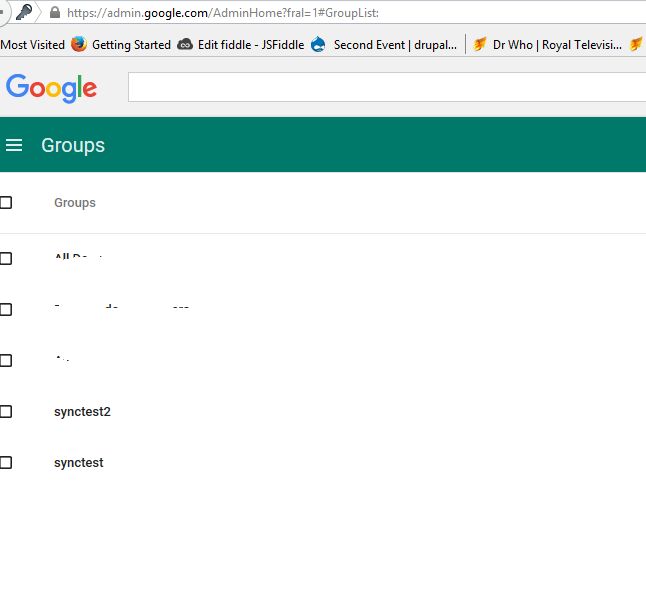
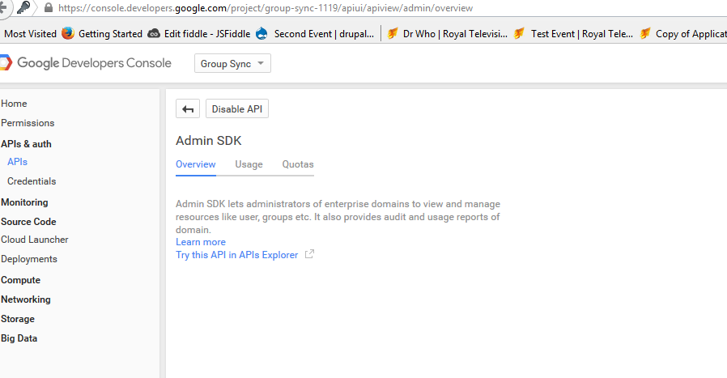
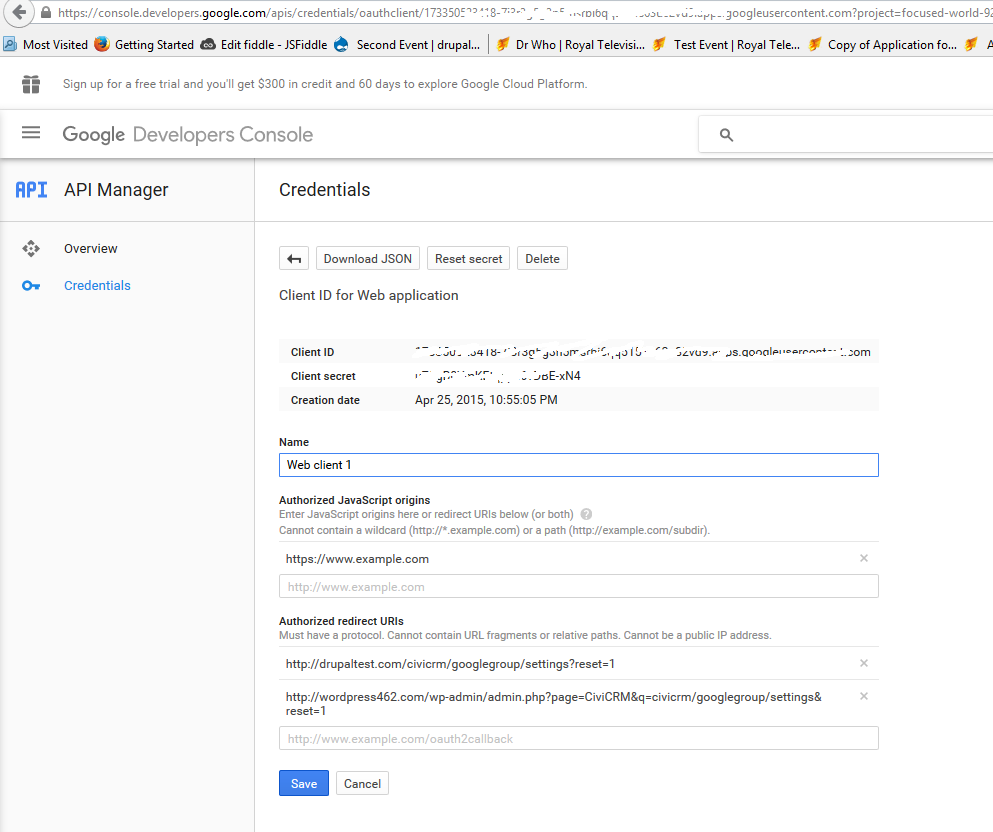
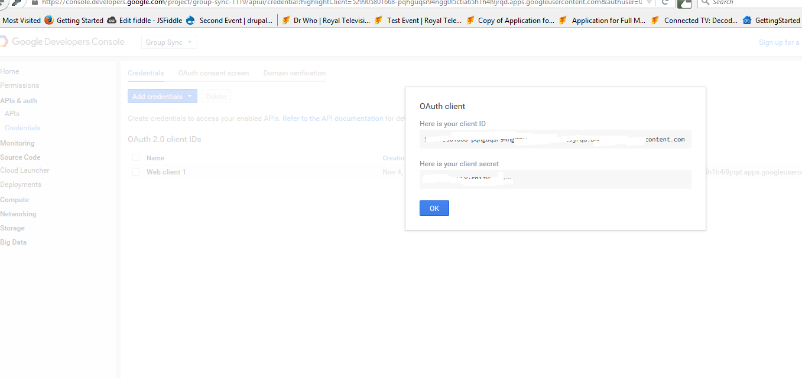
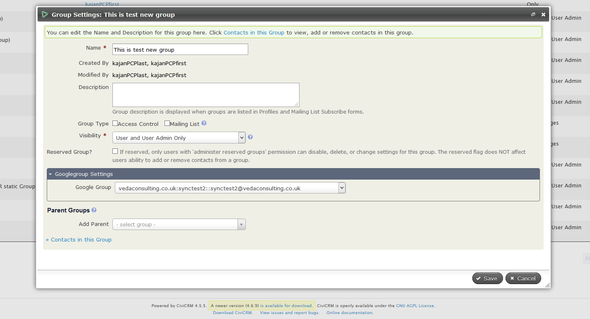

# Google Group Integration for CiviCRM  #

### Overview ###

CiviCRM can be integrated with Google Group

### Prerequisites ###
1. Have some test groups in https://admin.google.com for your domain

2. Have your Admin SDK api enabled in https://console.developers.google.com 

3. Create Google app with redirect URL and have your client ID and client secret

4. If your CiviCRM is already connected to Google app, you have to delete the access token in setting table in order to connect to new Google App.

### Installation ###

* Install the extension manually in CiviCRM. More details [here](http://wiki.civicrm.org/confluence/display/CRMDOC/Extensions#Extensions-Installinganewextension) about installing extensions in CiviCRM.
* Fill in GOOGLE_CLIENT_KEY and GOOGLE_SECERT_KEY in googlegroup.php
* Configure Google Group details in Mailings >> Googlegroup Settings(civicrm/googlegroup/settings?reset=1)

### Usage ###
* Warning: Contacts in CiviCRM will exactly match in Google Group after sync. That means contacts which are not in CiviCRM but in Google Group will be removed during the sync to keep contacts same in both
* Sync CiviCRM with Google group in Mailings >> Sync Civi Contacts To Googlegroup

### Support ###

support (at) vedaconsulting.co.uk

